# Koe Squad -- Task Dependency Graph

## Overview
49 tasks | 32 dependency edges | 17 independent tasks (no task dependencies)

## Dependency Graph (Mermaid)

```mermaid
graph TD
    subgraph CHIEF["koe-chief (Orchestration)"]
        KOE_CHIEF_001[diagnostico-koe]
        KOE_CHIEF_002[route-request]
        KOE_CHIEF_003[context-analysis]
        KOE_CHIEF_004[sovereignty-check]
        KOE_CHIEF_005[pipeline-kickoff]
    end

    subgraph COL["koe-coletor (Collection)"]
        KOE_COL_001[capture-idea]
        KOE_COL_002[process-queue]
        KOE_COL_003[tag-and-prioritize]
        KOE_COL_004[curated-consumption]
        KOE_COL_005[active-recovery]
        KOE_COL_006[archive-review]
    end

    subgraph SIN["koe-sintetizador (Synthesis)"]
        KOE_SIN_001[cross-domain-synthesis]
        KOE_SIN_002[name-framework]
        KOE_SIN_003[iceberg-depth]
        KOE_SIN_004[big-idea-generation]
        KOE_SIN_005[pattern-recognition]
        KOE_SIN_006[digital-renaissance-audit]
    end

    subgraph ARQ["koe-arquiteto (Architecture/Creation)"]
        KOE_ARQ_001[write-apag-content]
        KOE_ARQ_002[create-newsletter]
        KOE_ARQ_003[deep-work-session]
        KOE_ARQ_004[content-cascade-foundation]
        KOE_ARQ_005[course-module]
        KOE_ARQ_006[youtube-script]
    end

    subgraph DIST["koe-distribuidor (Distribution)"]
        KOE_DIST_001[newsletter-to-threads]
        KOE_DIST_002[video-to-clips]
        KOE_DIST_003[social-matrix-adapt]
        KOE_DIST_004[cascade-calendar]
        KOE_DIST_005[leverage-ratio-audit]
        KOE_DIST_006[platform-optimization]
    end

    subgraph MND["koe-mindset (Mindset)"]
        KOE_MND_001[conscious-conditioning]
        KOE_MND_002[habit-loop-reengineering]
        KOE_MND_003[polarity-mapping]
        KOE_MND_004[autoprogramming-protocol]
        KOE_MND_005[anti-conformity-audit]
    end

    subgraph BRD["koe-brand (Brand)"]
        KOE_BRD_001[you-are-the-niche-audit]
        KOE_BRD_002[personal-monopoly-design]
        KOE_BRD_003[leverage-stack-build]
        KOE_BRD_004[authority-construction]
        KOE_BRD_005[brand-lead-gen]
    end

    subgraph OFF["koe-offers (Offers)"]
        KOE_OFF_001[create-irresistible-offer]
        KOE_OFF_002[design-value-hierarchy]
        KOE_OFF_003[risk-reversal-strategy]
        KOE_OFF_004[godfather-offer]
        KOE_OFF_005[pricing-architecture]
    end

    subgraph ADV["koe-advisor (Advisory)"]
        KOE_ADV_001[sovereignty-test]
        KOE_ADV_002[one-person-business-audit]
        KOE_ADV_003[future-present-integration]
        KOE_ADV_004[life-design-session]
        KOE_ADV_005[paradox-resolution]
    end

    %% Chief dependencies
    KOE_CHIEF_001 --> KOE_CHIEF_003
    KOE_CHIEF_004 --> KOE_CHIEF_003

    %% Coletor chain
    KOE_COL_001 --> KOE_COL_002
    KOE_COL_001 --> KOE_COL_003
    KOE_COL_003 --> KOE_COL_002
    KOE_COL_003 --> KOE_COL_004
    KOE_COL_004 --> KOE_COL_005
    KOE_COL_002 --> KOE_COL_006
    KOE_COL_003 --> KOE_COL_006

    %% Sintetizador chain
    KOE_COL_002 --> KOE_SIN_001
    KOE_SIN_001 --> KOE_SIN_002
    KOE_SIN_001 --> KOE_SIN_003
    KOE_SIN_002 --> KOE_SIN_003
    KOE_COL_002 --> KOE_SIN_004
    KOE_SIN_001 --> KOE_SIN_004
    KOE_SIN_002 --> KOE_SIN_004
    KOE_SIN_003 --> KOE_SIN_004
    KOE_COL_002 --> KOE_SIN_005
    KOE_COL_003 --> KOE_SIN_005
    KOE_COL_003 --> KOE_SIN_006
    KOE_SIN_005 --> KOE_SIN_006

    %% Distributor dependencies (input references)
    KOE_ARQ_002 -.-> KOE_DIST_001
    KOE_ARQ_006 -.-> KOE_DIST_002
    KOE_ARQ_004 -.-> KOE_DIST_004
    KOE_DIST_001 -.-> KOE_DIST_004
    KOE_DIST_002 -.-> KOE_DIST_004
    KOE_DIST_003 -.-> KOE_DIST_004
    KOE_ARQ_003 -.-> KOE_DIST_005
    KOE_DIST_004 -.-> KOE_DIST_005

    %% Brand chain
    KOE_BRD_001 --> KOE_BRD_002
    KOE_BRD_002 --> KOE_BRD_003
    KOE_BRD_001 --> KOE_BRD_004
    KOE_BRD_002 --> KOE_BRD_005
    KOE_BRD_004 --> KOE_BRD_005

    %% Offers chain
    KOE_OFF_002 --> KOE_OFF_004
    KOE_OFF_003 --> KOE_OFF_004
    KOE_OFF_002 --> KOE_OFF_005

    %% Mindset chain
    KOE_MND_001 --> KOE_MND_004

    %% Advisor chain
    KOE_ADV_001 --> KOE_ADV_002
    KOE_MND_003 --> KOE_ADV_003
```



## By Agent

### koe-chief (Orchestration)
| Task ID | Name | Depends On | Blocks |
|---------|------|------------|--------|
| KOE_CHIEF_001 | diagnostico-koe | -- | KOE_CHIEF_003 |
| KOE_CHIEF_002 | route-request | -- | -- |
| KOE_CHIEF_003 | context-analysis | KOE_CHIEF_001, KOE_CHIEF_004 | -- |
| KOE_CHIEF_004 | sovereignty-check | -- | KOE_CHIEF_003 |
| KOE_CHIEF_005 | pipeline-kickoff | -- | -- |

### koe-coletor (Collection)
| Task ID | Name | Depends On | Blocks |
|---------|------|------------|--------|
| KOE_COL_001 | capture-idea | -- | KOE_COL_002, KOE_COL_003 |
| KOE_COL_002 | process-queue | KOE_COL_001, KOE_COL_003 | KOE_COL_006, KOE_SIN_001, KOE_SIN_004, KOE_SIN_005 |
| KOE_COL_003 | tag-and-prioritize | KOE_COL_001 | KOE_COL_002, KOE_COL_004, KOE_COL_006, KOE_SIN_005, KOE_SIN_006 |
| KOE_COL_004 | curated-consumption | KOE_COL_003 | KOE_COL_005 |
| KOE_COL_005 | active-recovery | KOE_COL_004 | -- |
| KOE_COL_006 | archive-review | KOE_COL_002, KOE_COL_003 | -- |

### koe-sintetizador (Synthesis)
| Task ID | Name | Depends On | Blocks |
|---------|------|------------|--------|
| KOE_SIN_001 | cross-domain-synthesis | KOE_COL_002 | KOE_SIN_002, KOE_SIN_003, KOE_SIN_004 |
| KOE_SIN_002 | name-framework | KOE_SIN_001 | KOE_SIN_003, KOE_SIN_004 |
| KOE_SIN_003 | iceberg-depth | KOE_SIN_001, KOE_SIN_002 | KOE_SIN_004 |
| KOE_SIN_004 | big-idea-generation | KOE_COL_002, KOE_SIN_001, KOE_SIN_002, KOE_SIN_003 | -- |
| KOE_SIN_005 | pattern-recognition | KOE_COL_002, KOE_COL_003 | KOE_SIN_006 |
| KOE_SIN_006 | digital-renaissance-audit | KOE_COL_003, KOE_SIN_005 | -- |

### koe-arquiteto (Architecture/Creation)
| Task ID | Name | Depends On | Blocks |
|---------|------|------------|--------|
| KOE_ARQ_001 | write-apag-content | -- | -- |
| KOE_ARQ_002 | create-newsletter | -- | KOE_DIST_001 (input) |
| KOE_ARQ_003 | deep-work-session | -- | KOE_DIST_005 (input) |
| KOE_ARQ_004 | content-cascade-foundation | -- | KOE_DIST_004 (input) |
| KOE_ARQ_005 | course-module | -- | -- |
| KOE_ARQ_006 | youtube-script | -- | KOE_DIST_002 (input) |

### koe-distribuidor (Distribution)
| Task ID | Name | Depends On | Blocks |
|---------|------|------------|--------|
| KOE_DIST_001 | newsletter-to-threads | KOE_ARQ_002 (input) | KOE_DIST_004 (input) |
| KOE_DIST_002 | video-to-clips | KOE_ARQ_006 (input) | KOE_DIST_004 (input) |
| KOE_DIST_003 | social-matrix-adapt | -- | KOE_DIST_004 (input) |
| KOE_DIST_004 | cascade-calendar | KOE_ARQ_004, KOE_DIST_001, KOE_DIST_002, KOE_DIST_003 (inputs) | KOE_DIST_005 (input) |
| KOE_DIST_005 | leverage-ratio-audit | KOE_ARQ_003, KOE_DIST_004 (inputs) | -- |
| KOE_DIST_006 | platform-optimization | -- | -- |

### koe-mindset (Mindset)
| Task ID | Name | Depends On | Blocks |
|---------|------|------------|--------|
| KOE_MND_001 | conscious-conditioning | -- | KOE_MND_004 |
| KOE_MND_002 | habit-loop-reengineering | -- | -- |
| KOE_MND_003 | polarity-mapping | -- | KOE_ADV_003 |
| KOE_MND_004 | autoprogramming-protocol | KOE_MND_001 | -- |
| KOE_MND_005 | anti-conformity-audit | -- | -- |

### koe-brand (Brand)
| Task ID | Name | Depends On | Blocks |
|---------|------|------------|--------|
| KOE_BRD_001 | you-are-the-niche-audit | -- | KOE_BRD_002, KOE_BRD_004 |
| KOE_BRD_002 | personal-monopoly-design | KOE_BRD_001 | KOE_BRD_003, KOE_BRD_005 |
| KOE_BRD_003 | leverage-stack-build | KOE_BRD_002 | -- |
| KOE_BRD_004 | authority-construction | KOE_BRD_001 | KOE_BRD_005 |
| KOE_BRD_005 | brand-lead-gen | KOE_BRD_002, KOE_BRD_004 | -- |

### koe-offers (Offers)
| Task ID | Name | Depends On | Blocks |
|---------|------|------------|--------|
| KOE_OFF_001 | create-irresistible-offer | -- | -- |
| KOE_OFF_002 | design-value-hierarchy | -- | KOE_OFF_004, KOE_OFF_005 |
| KOE_OFF_003 | risk-reversal-strategy | -- | KOE_OFF_004 |
| KOE_OFF_004 | godfather-offer | KOE_OFF_002, KOE_OFF_003 | -- |
| KOE_OFF_005 | pricing-architecture | KOE_OFF_002 | -- |

### koe-advisor (Advisory)
| Task ID | Name | Depends On | Blocks |
|---------|------|------------|--------|
| KOE_ADV_001 | sovereignty-test | -- | KOE_ADV_002 |
| KOE_ADV_002 | one-person-business-audit | KOE_ADV_001 | -- |
| KOE_ADV_003 | future-present-integration | KOE_MND_003 | -- |
| KOE_ADV_004 | life-design-session | -- | -- |
| KOE_ADV_005 | paradox-resolution | -- | -- |

## Critical Paths

### Content Pipeline (longest chain -- 8 tasks)
```
KOE_COL_001 (capture-idea)
  --> KOE_COL_003 (tag-and-prioritize)
    --> KOE_COL_002 (process-queue)  [also needs COL_001]
      --> KOE_SIN_001 (cross-domain-synthesis)
        --> KOE_SIN_002 (name-framework)
          --> KOE_SIN_003 (iceberg-depth)  [also needs SIN_001]
            --> KOE_SIN_004 (big-idea-generation)  [also needs COL_002, SIN_001, SIN_002]
              --> [koe-arquiteto creates content]
                --> [koe-distribuidor distributes]
```

### Brand Pipeline (4 tasks)
```
KOE_BRD_001 (you-are-the-niche-audit)
  --> KOE_BRD_002 (personal-monopoly-design)
    --> KOE_BRD_003 (leverage-stack-build)
  --> KOE_BRD_004 (authority-construction)
    --> KOE_BRD_005 (brand-lead-gen)  [also needs BRD_002]
```

### Offers Pipeline (3 tasks)
```
KOE_OFF_002 (design-value-hierarchy) -+-> KOE_OFF_004 (godfather-offer)
KOE_OFF_003 (risk-reversal-strategy) -+
KOE_OFF_002 --> KOE_OFF_005 (pricing-architecture)
```

### Distribution Pipeline (5 tasks, input-driven)
```
KOE_ARQ_002 (newsletter) -.-> KOE_DIST_001 (threads) -.+
KOE_ARQ_006 (youtube)    -.-> KOE_DIST_002 (clips)   -.+-> KOE_DIST_004 (calendar)
                               KOE_DIST_003 (social)  -.+       |
KOE_ARQ_004 (cascade)    -.-----------------------------.+       v
                                                          KOE_DIST_005 (leverage-audit)
```

### Cross-Agent Pipeline (mindset --> advisor)
```
KOE_MND_003 (polarity-mapping) --> KOE_ADV_003 (future-present-integration)
```

## Independent Tasks (17 -- no task dependencies, can execute anytime)

| Task ID | Agent | Name |
|---------|-------|------|
| KOE_CHIEF_002 | koe-chief | route-request |
| KOE_CHIEF_004 | koe-chief | sovereignty-check |
| KOE_CHIEF_005 | koe-chief | pipeline-kickoff |
| KOE_COL_001 | koe-coletor | capture-idea |
| KOE_ARQ_001 | koe-arquiteto | write-apag-content |
| KOE_ARQ_002 | koe-arquiteto | create-newsletter |
| KOE_ARQ_003 | koe-arquiteto | deep-work-session |
| KOE_ARQ_004 | koe-arquiteto | content-cascade-foundation |
| KOE_ARQ_005 | koe-arquiteto | course-module |
| KOE_ARQ_006 | koe-arquiteto | youtube-script |
| KOE_DIST_003 | koe-distribuidor | social-matrix-adapt |
| KOE_DIST_006 | koe-distribuidor | platform-optimization |
| KOE_MND_001 | koe-mindset | conscious-conditioning |
| KOE_MND_002 | koe-mindset | habit-loop-reengineering |
| KOE_MND_003 | koe-mindset | polarity-mapping |
| KOE_MND_005 | koe-mindset | anti-conformity-audit |
| KOE_OFF_001 | koe-offers | create-irresistible-offer |
| KOE_OFF_002 | koe-offers | design-value-hierarchy |
| KOE_OFF_003 | koe-offers | risk-reversal-strategy |
| KOE_BRD_001 | koe-brand | you-are-the-niche-audit |
| KOE_ADV_001 | koe-advisor | sovereignty-test |
| KOE_ADV_004 | koe-advisor | life-design-session |
| KOE_ADV_005 | koe-advisor | paradox-resolution |

> **Note**: koe-arquiteto tasks have no formal task dependencies in frontmatter but require Big Ideas from koe-sintetizador as input content. Similarly, koe-distribuidor tasks reference koe-arquiteto outputs as required inputs (shown as dashed edges `-.->` in the Mermaid graph).

## Dependency Edge Legend

| Edge Style | Meaning |
|------------|---------|
| `-->` (solid) | Formal dependency declared in frontmatter `dependencies.tasks[]` or `dependencies: [...]` |
| `-.->` (dashed) | Input dependency -- task requires output from another task as `inputs.required` |

---

*Generated from 49 task files in `squads/koe/tasks/` -- 2026-02-14*
