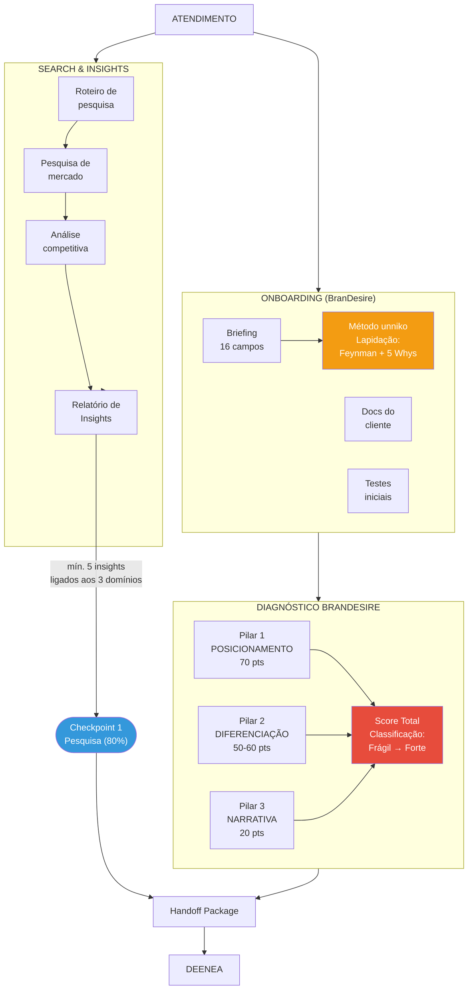
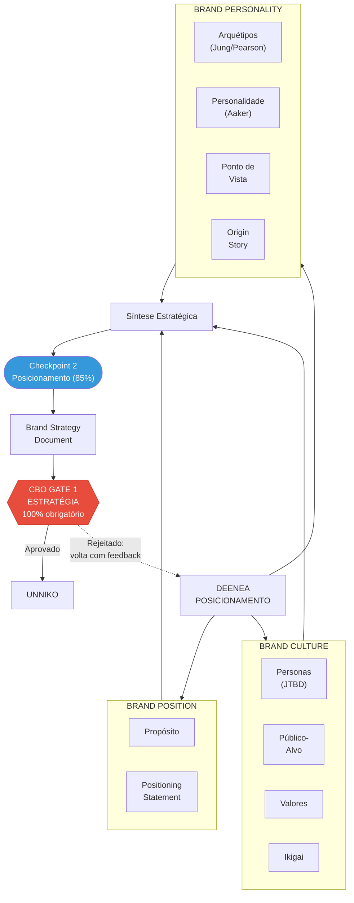
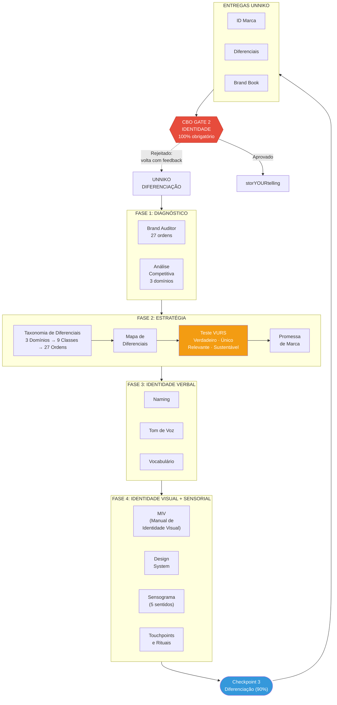
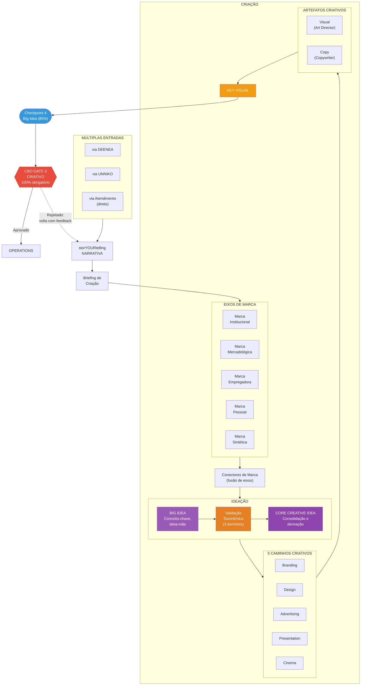
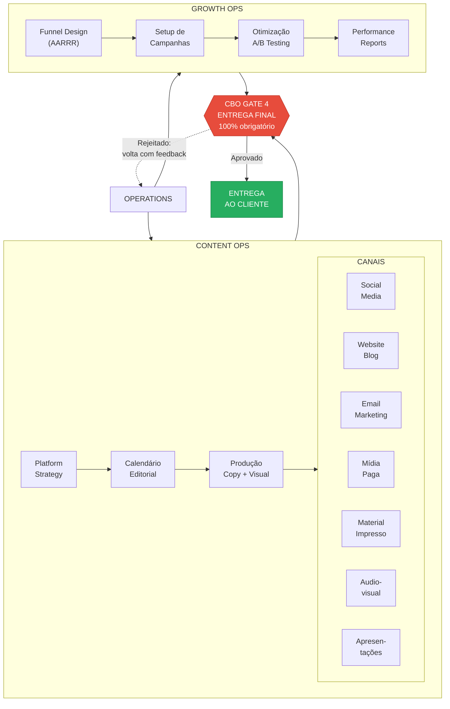

# Fluxograma Completo — squAId criaTTivados

> Workflow completo do BranDesire: do Atendimento à Entrega Final

---

## Visão Macro (Backbone)

```mermaid
flowchart LR
    ATD["ATENDIMENTO"]
    SI["SEARCH &<br/>INSIGHTS"]
    DEE["DEENEA<br/>Posicionamento"]
    G1{{"CBO GATE 1<br/>Estratégia"}}
    UNK["UNNIKO<br/>Diferenciação"]
    G2{{"CBO GATE 2<br/>Identidade"}}
    STY["storYOUR<br/>telling<br/>Narrativa"]
    G3{{"CBO GATE 3<br/>Criativo"}}
    OPS["OPERATIONS"]
    G4{{"CBO GATE 4<br/>Entrega"}}
    CLI["CLIENTE"]

    ATD --> SI
    ATD --> DEE
    SI --> DEE
    DEE --> G1
    G1 -->|Aprovado| UNK
    G1 -.->|Rejeitado| DEE
    UNK --> G2
    G2 -->|Aprovado| STY
    G2 -.->|Rejeitado| UNK
    STY --> G3
    G3 -->|Aprovado| OPS
    G3 -.->|Rejeitado| STY
    OPS --> G4
    G4 -->|Aprovado| CLI
    G4 -.->|Rejeitado| OPS

    ATD -.->|"entrada direta"| STY
    UNK -.->|"entrada direta"| STY

    style G1 fill:#ff6b6b,color:#fff,stroke:#c0392b
    style G2 fill:#ff6b6b,color:#fff,stroke:#c0392b
    style G3 fill:#ff6b6b,color:#fff,stroke:#c0392b
    style G4 fill:#ff6b6b,color:#fff,stroke:#c0392b
    style ATD fill:#34495e,color:#fff
    style CLI fill:#27ae60,color:#fff
```



---

## Fluxo Detalhado: ATENDIMENTO + SEARCH & INSIGHTS



---

## Fluxo Detalhado: DEENEA (Posicionamento)



---

## Fluxo Detalhado: UNNIKO (Diferenciação)



---

## Fluxo Detalhado: storYOURtelling (Narrativa + Criação)



---

## Fluxo Detalhado: OPERATIONS (Content Ops + Growth Ops)



---

## Fluxo Completo em Texto (Referência Linear)

```
═══════════════════════════════════════════════════════════════
                    WORKFLOW COMPLETO
              squAId criaTTivados v2.1
═══════════════════════════════════════════════════════════════

🏢 ATENDIMENTO
│
├── ONBOARDING (BranDesire)
│   ├── Briefing (16 campos)
│   │   └── ♦ Método unniko (lapidação: Feynman + 5 Whys)
│   ├── Docs do cliente
│   └── Testes iniciais
│
├── DIAGNÓSTICO BRANDESIRE
│   ├── Pilar 1: Posicionamento (70 pts)
│   ├── Pilar 2: Diferenciação (50-60 pts)
│   ├── Pilar 3: Narrativa (20 pts)
│   └── Score → Classificação: Frágil → Em Construção → Em Desenvolvimento → Consistente → Forte
│
└── 🔍 SEARCH & INSIGHTS
    ├── Roteiro de pesquisa
    ├── Pesquisa de mercado
    ├── Análise competitiva
    └── Relatório de Insights (mín. 5 insights × 3 domínios)
        └── ✓ Checkpoint 1: Pesquisa (80%)

    📦 Handoff Package
    │
    ▼

💎 DEENEA [POSICIONAMENTO]
│
├── Brand Position
│   ├── Propósito
│   └── Positioning Statement
│
├── Brand Culture
│   ├── Personas (JTBD)
│   ├── Público-Alvo
│   ├── Valores
│   └── Ikigai
│
├── Brand Personality
│   ├── Arquétipos (Jung/Pearson)
│   ├── Personalidade (Aaker 5 dimensões)
│   ├── Ponto de Vista
│   └── Origin Story
│
└── Síntese → 📄 Brand Strategy Document
    └── ✓ Checkpoint 2: Posicionamento (85%)

    ══════════════════════════════════════
    🚦 CBO GATE 1: ESTRATÉGIA (100%)
    Rejeitado? → Volta para DEENEA
    ══════════════════════════════════════
    │
    ▼

🦄 UNNIKO [DIFERENCIAÇÃO]
│
├── Fase 1: Diagnóstico
│   ├── Brand Audit (27 ordens)
│   └── Análise Competitiva (3 domínios)
│
├── Fase 2: Estratégia de Diferenciação
│   ├── Taxonomia: 3 Domínios → 9 Classes → 27 Ordens
│   │   ├── Domínio I:  Substantiva (FAZ)
│   │   ├── Domínio II: Simbólica (SIGNIFICA)
│   │   └── Domínio III: Distintividade (RECONHECE)
│   ├── Mapa de Diferenciais
│   ├── Teste VURS (Verdadeiro, Único, Relevante, Sustentável)
│   └── Promessa de Marca
│
├── Fase 3: Identidade Verbal
│   ├── Naming
│   ├── Tom de Voz
│   └── Vocabulário da marca
│
├── Fase 4: Identidade Visual + Sensorial
│   ├── MIV (Manual de Identidade Visual)
│   ├── Design System (cromática, tipografia, estilo)
│   ├── Sensograma (5 sentidos — Lindstrom)
│   └── Touchpoints e Rituais
│
└── Entregas: ID Marca + Diferenciais + Brand Book
    └── ✓ Checkpoint 3: Diferenciação (90%)

    ══════════════════════════════════════
    🚦 CBO GATE 2: IDENTIDADE (100%)
    Rejeitado? → Volta para UNNIKO
    ══════════════════════════════════════
    │
    ▼

🎬 storYOURtelling [NARRATIVA]
│
├── ⚡ Múltiplas entradas (DEENEA, UNNIKO, Atendimento)
│
├── 📋 Briefing de Criação (obrigatório, qualquer origem)
│
├── EIXOS DE MARCA — para qual marca a comunicação serve?
│   ├── Marca Institucional (posicionamento, diferenciais)
│   ├── Marca Mercadológica (produto, preço, CTA, oferta)
│   ├── Marca Empregadora (cultura, talentos)
│   ├── Marca Pessoal (narrativa individual)
│   ├── Marca Sintética (fusão/combinação)
│   └── 🔗 Conectores de Marca (quando 2+ eixos na mesma campanha)
│
├── 💡 BIG IDEA
│   ├── Conceito-chave, ideia-mãe
│   └── Validação Taxonômica (reforça ≥1 domínio, não contradiz nenhum)
│
├── 📐 CORE CREATIVE IDEA
│   └── Consolidação, explicação e derivação da Big Idea
│
├── 5 CAMINHOS CRIATIVOS (um ou mais por campanha)
│   ├── 🏷️  Branding — linguagem de marca, posicionamento
│   ├── 🎨 Design — linguagem visual (80/20), gráfico ou produto
│   ├── 📢 Advertising — criatividade premiável (Cannes, London Awards)
│   ├── 📊 Presentation — pitches, palestras, boards, workshops
│   └── 🎬 Cinema — filmes, séries, documentários
│
├── ARTEFATOS CRIATIVOS
│   ├── Visual (Art Director)
│   └── Copy (Copywriter)
│
└── ⭐ KEY VISUAL
    └── ✓ Checkpoint 4: Big Idea (85%)

    ══════════════════════════════════════
    🚦 CBO GATE 3: CRIATIVO (100%)
    Rejeitado? → Volta para storYOURtelling
    ══════════════════════════════════════
    │
    ▼

⚙️ OPERATIONS (em paralelo)
│
├── 📝 CONTENT OPS
│   ├── Platform Strategy (5As: Aware → Appeal → Ask → Act → Advocate)
│   ├── Calendário Editorial
│   ├── Produção (copy + visual por plataforma)
│   └── CANAIS
│       ├── Social Media
│       ├── Website / Blog
│       ├── Email Marketing
│       ├── Mídia Paga
│       ├── Material Impresso
│       ├── Audiovisual
│       └── Apresentações
│
└── 📈 GROWTH OPS
    ├── Funnel Design (AARRR: Acquisition → Activation → Retention → Referral → Revenue)
    ├── Setup de Campanhas
    ├── Otimização (A/B Testing)
    └── Performance Reports + Feedback Loop

    ══════════════════════════════════════
    🚦 CBO GATE 4: ENTREGA FINAL (100%)
    Rejeitado? → Volta para Operations
    ══════════════════════════════════════
    │
    ▼

✅ ENTREGA AO CLIENTE

═══════════════════════════════════════════════════════════════
```

---

## Legenda

| Símbolo | Significado |
|---------|-------------|
| 🚦 | CBO Gate — validação executiva bloqueante (100% obrigatório) |
| ✓ | Checkpoint técnico — validação dentro da squad (score mínimo variável) |
| 📦 | Handoff Package — pacote de transição entre squads |
| ♦ | Método unniko — lapidação de respostas (Feynman + 5 Whys) |
| ⚡ | Múltiplas entradas — demanda pode vir de diferentes origens |
| 🔗 | Conectores de Marca — integração entre eixos de marca |
| 💡 | Big Idea — conceito-chave, ideia-mãe |
| 📐 | Core Creative Idea — consolidação e derivação da Big Idea |
| ⭐ | Key Visual — peça-chave visual, transição para Content |
| ─── → | Fluxo principal (aprovado) |
| ─ ─ → | Fluxo de rejeição (volta com feedback) |

---

## Diferenças vs. Fluxograma Anterior

| Item | Antes | Agora |
|------|-------|-------|
| CBO Gates | Ausentes | 4 gates bloqueantes com fluxo de rejeição |
| Checkpoints | Ausentes | 4 checkpoints técnicos com score mínimo |
| MIV e Naming | Na DEENEA | Movidos para UNNIKO (correto) |
| Big Idea duplicada | 2 blocos sem contexto | 1 bloco claro dentro da CRIAÇÃO |
| Growth Ops | Ausente | Presente, paralelo a Content Ops |
| Canais | 3 (com duplicata) | 7 canais distintos |
| Diagnóstico BranDesire | Pouco claro | Explícito com 3 pilares e scoring |
| Método unniko | Ausente | Presente no Onboarding/Briefing |
| Taxonomia 3D/9C/27O | Ausente | Presente dentro do UNNIKO |
| Teste VURS | Ausente | Presente dentro do UNNIKO |
| Eixos de Marca | Presentes | Presentes + Conectores de Marca |
| Core Creative Idea | Presente | Presente com distinção clara da Big Idea |
| Key Visual | Ausente | Presente como transição para Content |

---

*squAId criaTTivados v2.1 — Workflow Completo*
*Edu Garretano × Claude | Synkra AIOS*
